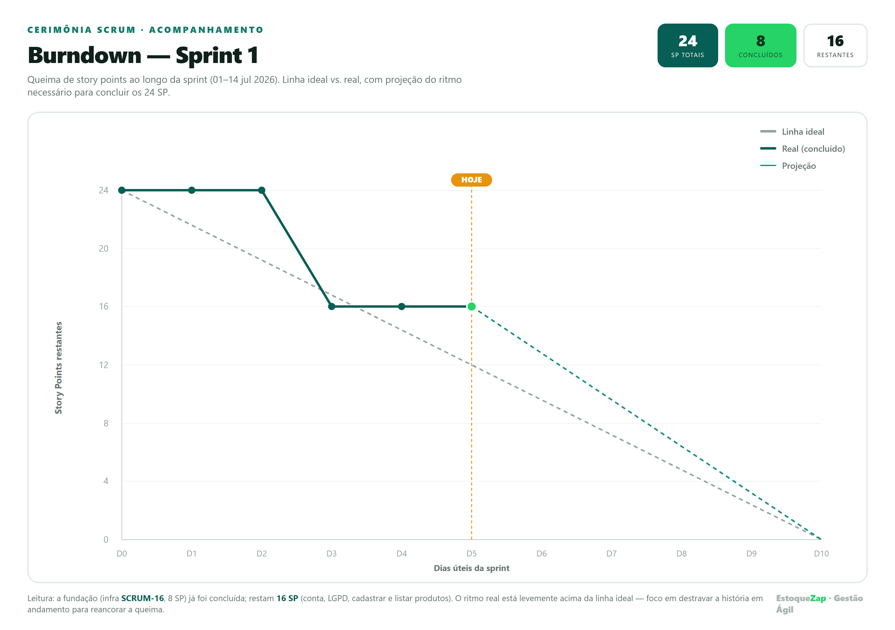
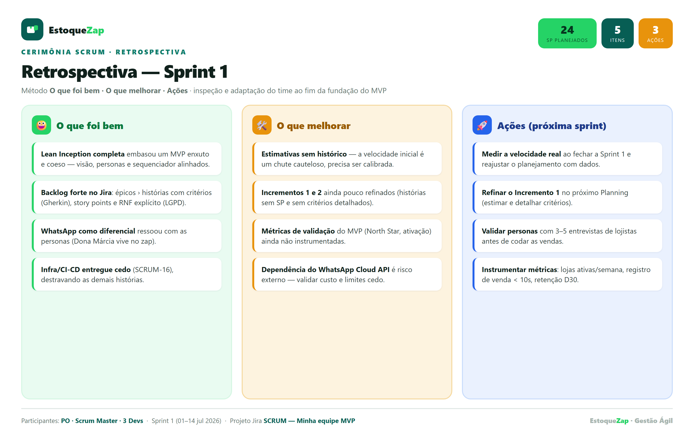

<div align="center">

# 📦 EstoqueZap

### Gestão de estoque e vendas para o pequeno comércio — simples como mandar um zap.


*MVP da Sprint de **Gestão Ágil de Projetos e Produtos***

</div>

---

## 🎯 Sobre o produto

O **EstoqueZap** é um aplicativo móvel de gestão de estoque e vendas para **pequenos comerciantes e MEIs** (mercadinhos, papelarias, lojas de bairro). Ele registra vendas em segundos e **avisa pelo WhatsApp quando um produto está acabando** — encontrando o lojista onde ele já está. Diferente de ERPs caros e do controle manual em caderno, é **simples e roda no celular**.

> **Problema** · O pequeno comércio perde vendas por ruptura de estoque e trava capital com excesso.
> **Solução** · Controle de estoque simples, com baixa automática nas vendas e alertas no WhatsApp.

---

## 🗂️ Entregáveis

| # | Entregável | Ferramenta | Acesso |
|---|-----------|-----------|--------|
| 1 | **Lean Inception + MVP Canvas** | Miro | 🔗 [Abrir no Miro](https://miro.com/app/board/uXjVH9vmgww=/?share_link_id=84683639477) |
| 2 | **Backlog do Produto** + DoR/DoD (com RNF) | Jira | 📄 [`product-backlog.pdf`](product-backlog.pdf) |
| 3 | **Backlog da Sprint 1** (detalhado, estimado) | Jira | 📄 [`sprint-backlog.pdf`](sprint-backlog.pdf) |
| 4 | **Wireframes** (protótipos de interface) | Figma | 🎨 [Figma](https://www.figma.com/design/vetyJN3ubc2MGYIrUh6U8a/EstoqueZap-%E2%80%94-Wireframes-Sprint-1) · 🖼️ [`wireframes/`](wireframes/) |
| 5 | **Vídeo de apresentação** (~5 min) | — | 🎬 [`video-url.txt`](video-url.txt) |

> 🟢 **Backlog implementado e vivo no Jira Cloud** — projeto *Minha equipe MVP* (`SCRUM`): **25 tickets** (3 épicos · 19 histórias · 3 enablers) com hierarquia épico→história, *story points*, prioridades, critérios de aceitação (Gherkin) e **Sprint 1 ativa**. Os PDFs acima são os **prints reais** desse backlog.

---

## 🔗 Links oficiais do projeto

| Recurso | Ferramenta | Acesso |
|---------|-----------|--------|
| **Board — Lean Inception + MVP Canvas** | Miro | 🔗 [Abrir no Miro](https://miro.com/app/board/uXjVH9vmgww=/?share_link_id=84683639477) |
| **Protótipo de wireframes** | Figma | 🎨 [Abrir no Figma](https://www.figma.com/design/vetyJN3ubc2MGYIrUh6U8a/EstoqueZap-%E2%80%94-Wireframes-Sprint-1) |
| **Vídeo de apresentação** | YouTube | 🎬 URL em [`video-url.txt`](video-url.txt) |

---

## 📱 Wireframes da Sprint 1

Protótipos de baixa fidelidade das **6 telas** do fluxo da Sprint 1 (cadastro da loja → LGPD → gestão de produtos), no **[protótipo do Figma](https://www.figma.com/design/vetyJN3ubc2MGYIrUh6U8a/EstoqueZap-%E2%80%94-Wireframes-Sprint-1)**. As imagens (`01 …` a `06 …`) e a **descrição textual** de cada tela estão em [`wireframes/`](wireframes/) — incluindo [`Descrição textual dos wireframes.docx`](wireframes/Descri%C3%A7%C3%A3o%20textual%20dos%20wireframes.docx).

---

## 🔄 Cerimônias da Sprint 1

<div align="center">

<br><br>

</div>

- 📉 **Burndown** — queima dos 24 SP da Sprint 1 (linha ideal × real × projeção).
- 🔄 **Retrospectiva** — *o que foi bem · o que melhorar · ações* (inspeção e adaptação).

---

## 🧭 Contexto de negócio

**Stakeholders** — *Internos:* sponsor/fundador, Product Owner, time de desenvolvimento, UX · *Usuários:* lojista (Dona Márcia) e vendedor (João) · *Externos:* fornecedor (Carlos), contador, cliente final, ANPD/LGPD.

**Time Scrum (enxuto — 5 pessoas):** 1 Product Owner · 1 Scrum Master *(part-time)* · 3 desenvolvedores (full-stack, front/UX, back/QA).

**Personas** — 🟢 Dona Márcia (lojista/MEI · primária) · 🔵 João (vendedor · secundária) · 🟠 Carlos (fornecedor · incremento).

---

## 📁 Estrutura do repositório

```
├── README.md
├── canvas-url.txt              ← URL do board do Miro (Lean Inception + MVP Canvas)
├── product-backlog.pdf         ← backlog do produto + DoR/DoD (prints do Jira)
├── sprint-backlog.pdf          ← backlog da Sprint 1 (prints do Jira)
├── retrospectiva-sprint1.png   ← retrospectiva da Sprint 1
├── burndown-sprint1.png        ← burndown da Sprint 1
├── video-url.txt               ← URL do vídeo de apresentação
└── wireframes/                 ← 6 telas low-fi (01–06) + descrição textual (.docx) + link do Figma (.txt)
```

---

## 🛠️ Metodologia & referências

**Lean Inception** e **MVP Canvas** (Paulo Caroli) · **Scrum** (Kenneth Rubin, *Scrum Essencial*) · **Engenharia de Requisitos** (IREB) · Prototipação de baixa fidelidade.
Ferramentas: **Miro** · **Jira** · **Figma**.

---

<div align="center">

**Eliel Mesquita** · Pós-graduação — Gestão Ágil de Projetos e Produtos · 2026

</div>
