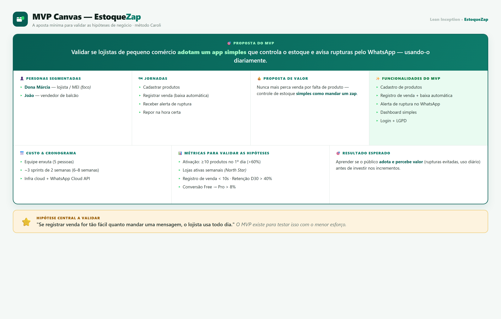
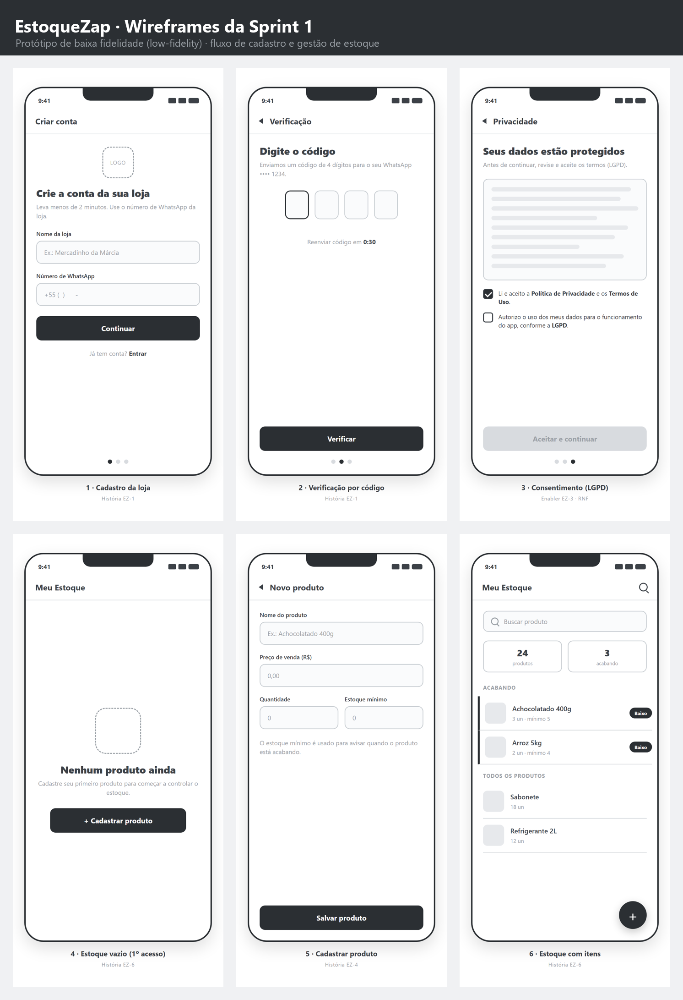

<div align="center">

# 📦 EstoqueZap

### Gestão de estoque e vendas para o pequeno comércio — simples como mandar um zap.


*MVP da Sprint de **Gestão Ágil de Projetos e Produtos***

</div>

---

## 🎯 Sobre o produto

O **EstoqueZap** é um aplicativo móvel de gestão de estoque e vendas para **pequenos comerciantes e MEIs** (mercadinhos, papelarias, lojas de bairro). Ele registra vendas em segundos e **avisa pelo WhatsApp quando um produto está acabando** — encontrando o lojista onde ele já está. Diferente de ERPs caros e complexos e do controle manual em caderno, é **simples e roda no celular**.

> **Problema** · O pequeno comércio perde vendas por ruptura de estoque e trava capital com excesso.
> **Solução** · Controle de estoque simples, com baixa automática nas vendas e alertas no WhatsApp.

---

## 🗂️ Entregáveis

| # | Entregável | Ferramenta | Acesso |
|---|-----------|-----------|--------|
| 1 | **Lean Inception + MVP Canvas** | Miro | 🔗 [`canvas-url.txt`](canvas-url.txt) |
| 2 | **Backlog do Produto** + DoR/DoD (com RNF) | Jira | 📄 [`product-backlog.pdf`](product-backlog.pdf) |
| 3 | **Backlog da Sprint 1** (detalhado, estimado) | Jira | 📄 [`sprint-backlog.pdf`](sprint-backlog.pdf) |
| 4 | **Wireframes** (baixa fidelidade) | Figma | 🖼️ [`wireframes/`](wireframes/) |
| 5 | **Vídeo de apresentação** (2–4 min) | — | 🎬 [veja abaixo](#-vídeo-de-apresentação) |

---

## 🧩 MVP Canvas

<div align="center">

</div>

---

## 📱 Wireframes da Sprint 1

<div align="center">

</div>

---

## 🧭 Contexto de negócio

**Stakeholders** — *Internos:* sponsor/fundador, Product Owner, time de desenvolvimento, UX · *Usuários:* lojista (Dona Márcia) e vendedor (João) · *Externos:* fornecedor (Carlos), contador, cliente final, ANPD/LGPD.

**Time Scrum (enxuto — 5 pessoas)**

| Papel | Qtd | Habilidades |
|-------|-----|-------------|
| Product Owner | 1 | Visão de produto, priorização, métricas |
| Scrum Master *(part-time)* | 1 | Facilitação ágil, remoção de impedimentos |
| Dev Full-stack | 1 | Front + back, integração WhatsApp |
| Dev Front + UX | 1 | UI/UX mobile, protótipos |
| Dev Back + QA | 1 | API, banco, testes |

**Personas** — 🟢 Dona Márcia (lojista/MEI · primária) · 🔵 João (vendedor · secundária) · 🟠 Carlos (fornecedor · incremento).

---

## 📚 Material de apoio

Documentos extras que embasaram a ideação (não obrigatórios, mas detalham o raciocínio):

- 📄 [**Documento de Discovery**](docs/discovery-estoquezap.pdf) — problema, mercado, personas, jornadas, concorrência, proposta de valor e métricas
- 📄 [**Lean Inception completa**](docs/lean-inception-estoquezap.pdf) — todas as etapas do método (Caroli): visão, é/não é, brainstorm, revisão técnica, jornada, sequenciador e MVP Canvas
- 🖼️ **Visuais** — [personas](docs/visuals/), [mapa de posicionamento](docs/visuals/mapa-posicionamento.png), [value proposition canvas](docs/visuals/value-proposition-canvas.png)
- 📥 **Jira** — [CSV de importação do backlog](jira/jira-import-backlog.csv) + [guia de importação](jira/COMO-IMPORTAR-NO-JIRA.md)

---

## 🎬 Vídeo de apresentação

▶️ **[Assista ao vídeo](COLE-AQUI-A-URL-DO-VIDEO)** · *(2 a 4 minutos)*

> Substitua o link acima pela URL do vídeo (ou adicione o arquivo de mídia na raiz do repositório). Veja também [`video-url.txt`](video-url.txt).

---

## 📁 Estrutura do repositório

```
EstoqueZap-MVP/
├── README.md                      ← você está aqui
├── canvas-url.txt                 ← URL do board do Miro (Lean Inception + MVP Canvas)
├── product-backlog.pdf            ← backlog do produto + DoR/DoD (Jira)
├── sprint-backlog.pdf             ← backlog da Sprint 1 (Jira)
├── video-url.txt                  ← URL do vídeo de apresentação
├── docs/                          ← material de apoio
│   ├── discovery-estoquezap.pdf
│   ├── lean-inception-estoquezap.pdf
│   └── visuals/                   ← personas, mapa 2×2, VPC, MVP canvas (PNG)
├── wireframes/                    ← 6 telas low-fi da Sprint 1 + panorama do fluxo
└── jira/                          ← CSV de importação do backlog + guia
```

---

## 🛠️ Metodologia & referências

**Lean Inception** e **MVP Canvas** (Paulo Caroli) · **Scrum** (Kenneth Rubin, *Scrum Essencial*) · **Engenharia de Requisitos** (IREB) · Prototipação de baixa fidelidade.
Ferramentas: **Miro** · **Jira** · **Figma**.

---

<div align="center">

**Eliel Mesquita** · Pós-graduação — Gestão Ágil de Projetos e Produtos · 2026

</div>
